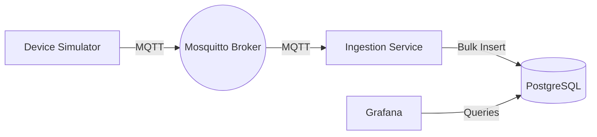

# IoT Telemetry Pipeline

This project is a resilient data pipeline designed to collect, transmit, and store real-time data from simulated IoT devices. It demonstrates best practices for IoT architectures, including appropriate protocols, and optimized time-series storage.

## System Architecture



### Components

1. **Device Simulator (Python)**: Reads industrial energy telemetry from a CSV dataset. Generates ISO-8601 UTC timestamps, formats the payload as JSON (mimicking a Modbus-to-MQTT bridge), and publishes to an MQTT topic hierarchy with built-in retry logic.
2. **Mosquitto (MQTT Broker)**: A lightweight, pub/sub messaging protocol ideal for IoT telemetry over unreliable networks.
3. **Ingestion Service (Python)**: Subscribes to the MQTT broker using topic wildcards (`factory/+/+/telemetry`). It buffers incoming messages and performs batch inserts into PostgreSQL for high performance and resilience.
4. **PostgreSQL**: A robust relational database. We utilize a composite index on device ID and timestamp to ensure rapid querying for time-series data.
5. **Grafana**: Pre-provisioned to connect to PostgreSQL out-of-the-box, providing real-time dashboards for metrics like voltage, current, and temperature.

## Protocol Choice Justification

- **Modbus (Simulation)**: Traditionally used in industrial settings for local, register-based hardware communication. Our simulator acts as if it has pulled data from a Modbus gateway.
- **MQTT**: We chose MQTT for telemetry transmission because it is extremely lightweight, uses a publish/subscribe model that decouples the sender from the receiver, and handles network disruptions well. Its hierarchical topics allow for scalable deployments across multiple factories and areas.

## Database Schema

```sql
CREATE TABLE IF NOT EXISTS device_telemetry (
    id SERIAL PRIMARY KEY,
    timestamp TIMESTAMPTZ NOT NULL,
    factory_id VARCHAR(50) NOT NULL,
    machine_id VARCHAR(50) NOT NULL,
    voltage REAL,
    current REAL,
    power_factor REAL,
    temperature REAL,
    kwh REAL
);

-- Composite index for extremely fast time-series queries by device
CREATE INDEX IF NOT EXISTS idx_telemetry_device_time 
ON device_telemetry (machine_id, timestamp DESC);
```

We use `TIMESTAMPTZ` to correctly handle timezone-aware events, and `REAL` for floating-point sensor data to optimize storage space.

## Quick Start Guide

### 1. Download the Dataset

We are using the **Industrial Energy Forecast Dataset** from Kaggle.

1. Download the dataset from Kaggle: [Industrial Energy Forecast Dataset](https://www.kaggle.com/) (Please search for "Industrial Energy Forecast Dataset" and download the CSV).
2. Rename the downloaded CSV file to `telemetry.csv` and place it in the `data/` folder:

   ```bash
   cp <download_path>/dataset.csv ./data/telemetry.csv
   ```

   *(Note: The first row should contain the headers. Ensure columns match the expected simulator output like Timestamp, Machine_ID, Voltage, etc. The simulator is designed to parse standard formats).*

### 2. Run the Stack

Start all components with Docker Compose:

```bash
docker-compose up --build -d
```

### 3. Verification

1. **Check Logs**: Ensure the ingestion service is receiving and batching data.

   ```bash
   docker-compose logs -f ingestion
   ```

2. **View Dashboard**: Open Grafana at [http://localhost:3000](http://localhost:3000) (Login: `admin` / `admin`).
3. Navigate to the **IoT Telemetry Dashboard** to view the real-time power metrics streaming in.

## Repository Structure

- `data/`: Place your downloaded dataset here.
- `database/`: Contains the `init.sql` script for schema initialization.
- `device_simulator/`: Code for the device simulator (MQTT Publisher).
- `ingestion_service/`: Code for the ingestion service (MQTT Subscriber & DB Writer).
- `grafana/`: Pre-configured dashboards and data sources.
- `docker-compose.yml`: Main deployment file.
